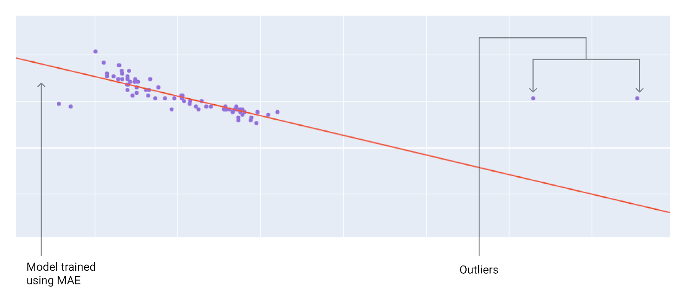
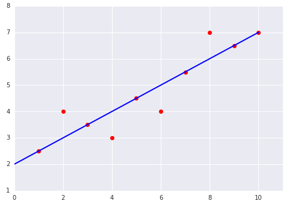
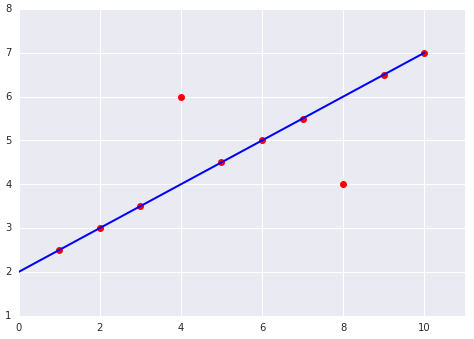

# Hồi quy tuyến tính: Mất mát (Loss)

> Nguồn: [Linear regression: Loss](https://developers.google.com/machine-learning/crash-course/linear-regression/loss)

**Mất mát** (loss) là đại lượng số đo mức **sai** của dự đoán: khoảng cách giữa nhãn dự đoán $y'$ và nhãn thật $y$. Mục tiêu huấn luyện là **giảm mất mát** tới mức thấp nhất có thể.

## Khoảng cách, không phải dấu

Nếu dự đoán 2 mà thực tế 5, ta không quan tâm sai âm ($-3$) hay dương — chỉ quan tâm **xa 3 đơn vị**. Hai cách bỏ dấu phổ biến:

- **Trị tuyệt đối:** $|y - y'|$
- **Bình phương:** $(y - y')^2$

## Các loại mất mát

| Loại | Định nghĩa |
|------|------------|
| $L_1$ loss | $\sum \|y - y'\|$ |
| MAE | $\frac{1}{N}\sum \|y - y'\|$ |
| $L_2$ loss | $\sum (y - y')^2$ |
| MSE | $\frac{1}{N}\sum (y - y')^2$ |
| RMSE | $\sqrt{\text{MSE}}$ |

Khác biệt $L_1$ vs $L_2$: bình phương **phạt nặng** sai số lớn, **giảm mạnh** sai số nhỏ ($<1$).

## Ví dụ $L_2$ (một điểm)

Mô hình $y' = 34 + (-4{,}6)\, x_1$, xe 2.370 pound → $y' \approx 23{,}1$, thực tế 24 MPG:

$$L_2 = (24 - 23{,}1)^2 = 0{,}81$$

## Chọn MSE hay MAE?

- **MSE/RMSE:** phạt nặng lỗi lớn; outlier kéo mô hình gần hơn; tối ưu thuận lợi cho gradient descent.
- **MAE:** bền với outlier; dễ diễn giải là sai số trung bình.

### Kiểm tra hiểu biết

Đồ thị **bên phải** có MSE cao hơn vì hai điểm lệch gấp đôi; bình phương làm loss tăng mạnh.

 

## Thuật ngữ

- [Loss](https://developers.google.com/machine-learning/glossary#loss)
- [MSE](https://developers.google.com/machine-learning/glossary#mean-squared-error-mse)
- [RMSE](https://developers.google.com/machine-learning/glossary#root-mean-squared-error-rmse)
- Outlier, Prediction
