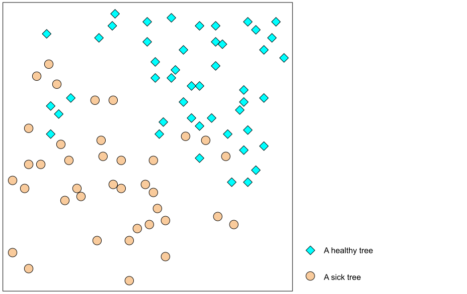
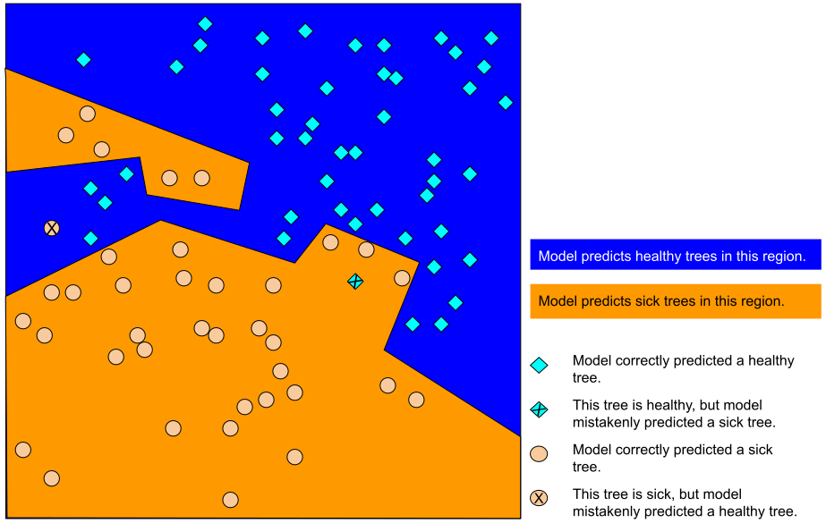
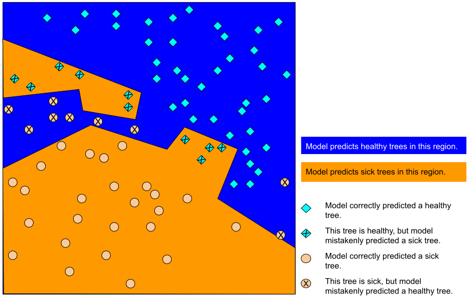
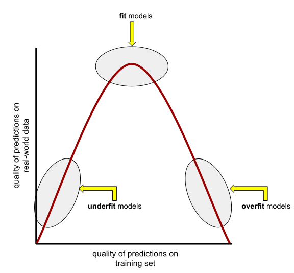
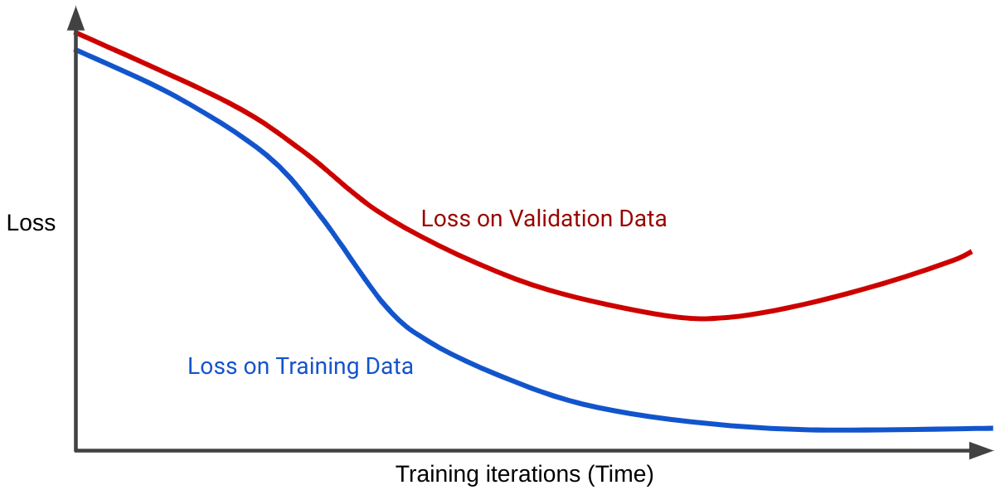

# Quá trình điều chỉnh quá mức (Overfitting)

> Nguồn: [Overfitting](https://developers.google.com/machine-learning/crash-course/overfitting/overfitting) — Google Machine Learning Crash Course

**Điều chỉnh quá mức** (overfitting) nghĩa là tạo mô hình khớp (ghi nhớ) tập huấn luyện quá sát, đến mức **dự đoán kém trên dữ liệu mới**. Mô hình overfit giống phát minh chạy tốt trong phòng thí nghiệm nhưng vô dụng ngoài đời thực.

> **Lưu ý:** Overfitting là vấn đề **rất phổ biến** trong ML, không chỉ lý thuyết.

## Ví dụ: rừng cây khỏe / cây bệnh

Hình dưới: kim cương xanh = cây khỏe, vòng tròn cam = cây bệnh (tập huấn luyện).

Bạn có thể vẽ đường cong, hình bầu dục\ldots\ để tách hai loại. Một đường phân chia **phức tạp** có thể phân loại đúng **gần như mọi** cây trên tập train (trừ một hai điểm).

Nhưng trên **tập kiểm tra** (dữ liệu mới), cùng mô hình đó lại **sai nhiều**:

Đây là **overfitting cổ điển**: tốt trên train, tệ trên test.

## Khớp (fit), overfit và underfit

Mô hình phải dự đoán tốt trên **dữ liệu mới** — tức mô hình phải **khớp** (fit) dữ liệu mới.

| Tình huống | Mô tả |
|------------|--------|
| **Overfit** | Tốt trên train, kém trên dữ liệu mới |
| **Underfit** | Kém cả trên train |
| **Khớp tốt (fit)** | Tốt trên train và khái quát tốt |

**Tổng quát hóa** (generalization) là đối lập của overfitting: mô hình dự đoán tốt trên dữ liệu mới. Đó là target của bạn.

Video liên quan (module 7): https://www.youtube.com/watch?v=TyT8i8YIcwI

## Phát hiện overfitting

Hai công cụ chính:

- **Đường cong mất mát** (loss curve): mất mát theo số vòng lặp huấn luyện.
- **Đường cong tổng quát hóa** (generalization curve): **hai** đường loss (train và validation) trên cùng đồ thị.

Ban đầu hai đường giống nhau, sau đó **tách ra**: loss train giảm/ổn định, loss **validation tăng** → overfitting.

Mô hình khớp tốt: hai đường có **hình dạng tương tự**.

## Nguyên nhân overfitting

Rộng ra, do một hoặc cả hai:

1. **Tập huấn luyện không đại diện** cho dữ liệu thực tế (hoặc validation/test).
2. **Mô hình quá phức tạp** so với bài toán.

## Điều kiện tổng quát hóa (dataset)

Để mô hình tổng quát tốt, dữ liệu nên thỏa:

- **IID** (independently and identically distributed): các mẫu không ảnh hưởng lẫn nhau.
- **Stationary** (dừng): phân phối không đổi mạnh theo thời gian.
- **Cùng phân phối** giữa train, validation, test và dữ liệu thực tế.

### Kiểm tra hiểu biết

**Chia tập sao cho train/val/test giống nhau về thống kê?**
→ **Xáo trộn (shuffle) kỹ** trước khi chia. Sắp xếp theo thời gian thường làm các tập **khác** phân phối.

**Mô hình dự đoán độ hot chương trình TV 3 năm tới, train trên 10 năm qua, hàng trăm triệu mẫu?**
→ **Có vấn đề:** gu người xem **không dừng**; quá khứ khó dự báo vài năm tới (non-stationary).

**Dự đoán thời gian đi bộ 1 dặm theo thời tiết 1 năm ở thành phố bốn mùa rõ?**
→ **Có thể**, nếu chia tập **đều các mùa** vào train/val/test.

### Bài tập thử thách: vé tàu

Mô hình gợi ý ngày mua vé tối ưu; loss thấp trên val/test nhưng đôi khi **rất tệ** trên dữ liệu thực.

**Vì sao?** **Vòng phản hồi** (feedback loop): gợi ý của mô hình làm người dùng mua vé sớm → công ty tăng giá → dữ liệu thực đổi → mô hình lỗi thời.

## Thuật ngữ

- [Overfitting](https://developers.google.com/machine-learning/glossary#overfitting)
- [Underfitting](https://developers.google.com/machine-learning/glossary#underfitting)
- [Generalization](https://developers.google.com/machine-learning/glossary#generalization)
- [Generalization curve](https://developers.google.com/machine-learning/glossary#generalization-curve)
- [Loss curve](https://developers.google.com/machine-learning/glossary#loss-curve)
- [Feedback loop](https://developers.google.com/machine-learning/glossary#feedback-loop)
- IID, stationarity, training set
