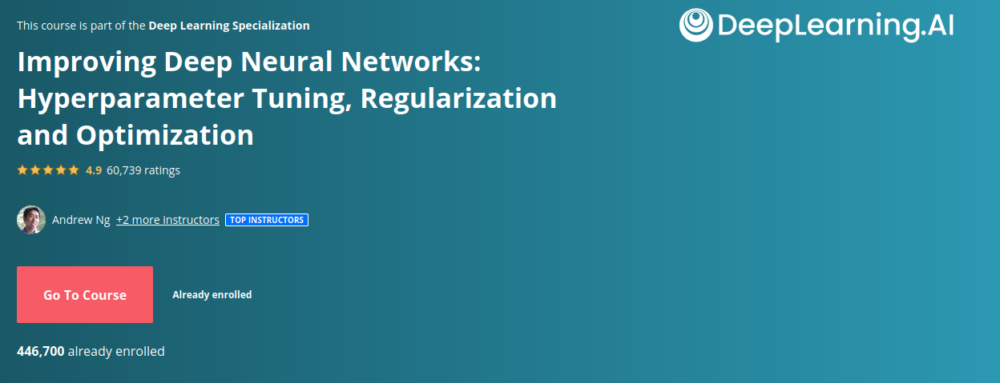

## Course 2 : [Improving Deep Neural Networks: Hyperparameter Tuning, Regularization and Optimization](.)

- [<b> Week 1</b>](week1)

    - [Lectures](week1/lectures)
    - [Assignment 1](week1/programming%20assignments/W1A1)
    - [Assignment 2](week1/programming%20assignments/W1A2)
    - [Assignment 3](week1/programming%20assignments/W1A3)

 

- [<b> Week 2</b>](week2)
    - [Lectures](week2/lectures)
    - [Assignment 1](week2/pogramming%20assignments/W2A1)

 

- [<b> Week 3</b>](week3)
    - [Lectures](week3/lectures)
    - [Assignment 1](week3/programming%20assignments/W3A1)

[Certificate Of Completion](https://coursera.org/share/613fdc81246090f08c019158a91cfe06)