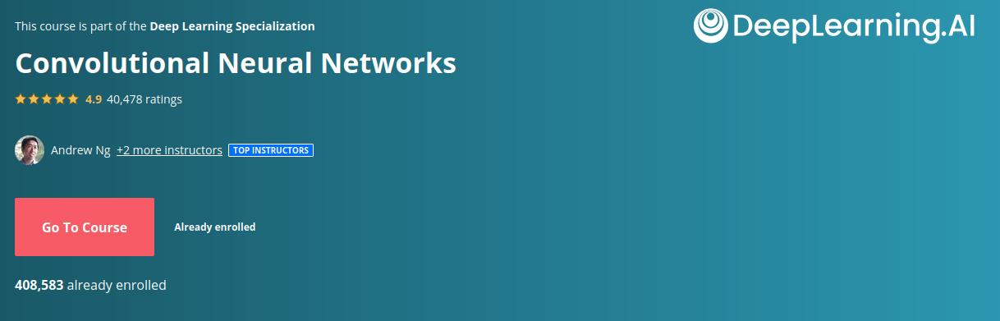

## Course 4 : [Convolutional Neural Networks](.)

- [<b>Week 1</b>](week1)
    - [Lectures](week1/lectures)
    - [Quiz](week1/Quiz%20-%20The%20Basics%20of%20ConvNets%20)
    - [Assignment 1](week1/W1A1)
    - [Assignment 2](week1/W1A2)

 

- [<b>Week 2</b>](week2)
  - [Lectures](week2/lectures)
  - [Quiz](week2/Quiz%20-%20Deep%20Convolutional%20Models)
  - [Assignment 1](week2/W2A1)
  - [Assignment 2](week2/W2A2)
  
   

- [<b>Week 3</b>](week3)
  - [Lectures](week3/lectures)
  - [Quiz](week3/Quiz%20-%20Detection%20Algorithms%20)
  - [Assignment 1](week3/C4W3A1)
  - [Assignment 2](week3/C4w3A2)

 

- [<b>Week 4</b>](week4)
  - [Lectures](week4/lectures)
  - [Quiz](week4/Quiz%20-%20Special%20Applications%3A%20Face%20Recognition%20%26%20Neural%20Style%20Transfer)
  - [Assignment 1](week4/C4W4A1)
  - [Assignment 2](week4/C4W4A2)

[Certificate Of Completion](https://coursera.org/share/4116ca69a9b3037a7d2f8d748e8eca08)